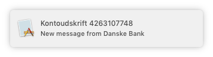
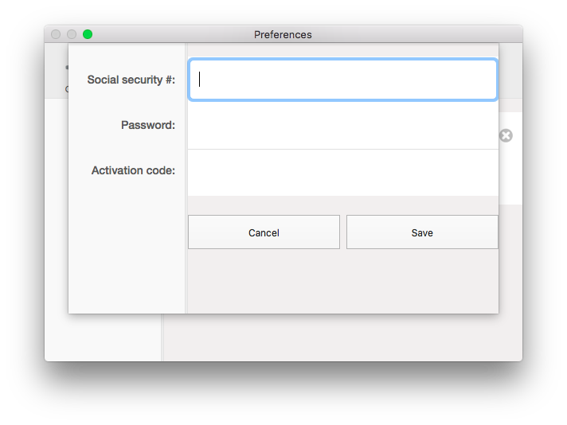
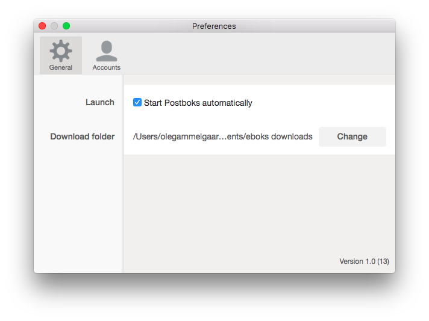
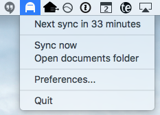

# Postboks
The Postboks app syncs your e-Boks documents to a folder on your mac in the background. You never have to log in to the e-Boks website using NemID again.

Whenever you receive a new document you will get a notification and clicking it opens the document in Preview.app.

Use at your own risk. ([e-Boks Terms of use](http://www.e-boks.dk/signup_terms.aspx?type=enduser)))

## Gettings started

### 1. Download the latest version of Postboks
Get it from [The releases page](https://github.com/olegam/Postboks/releases/latest).

### 2. Get your e-Boks mobile access credentials from e-boks.dk

### 3. Sign in using your e-Boks mobile access credentials

You can optinally choose to have Postboks started automatically when you reboot your mac.

The postboks app will live in your menu bar and check for new documents every hour.

Click the "Open documents folder" to see how all your documents are nicely organized by month.

You should note that your credentials are securely stored in the OS X keychain, but all your documents are stored as files on the disk. So you may want to enable disk encryption on your mac to make sure sensitive documents are encrypted.

## How to use with business accounts

e-Boks does not directly support using their API with a business/company account, but you can easily configure your personal account to get access to your business' e-Boks. This feature is supported in Postboks version 0.6 and later.

1. First you need to make sure you have an "e-Boks for business" account and it is subscribing to mail from all public senders.
1. You need to add delegate access to your business' e-Boks account. They call this "Shared folders" (or "adgange" in Danish).
1. Click on the Settings button ("Indstillinger" in Danish) and then click the "Shared folders" ("Adgange") menu item.
1. Select the "person" type and enter your CPR number.
1. Chose a random password and select an expiry date (way out in the future).
1. Log in with your personal e-Boks account on the website and validate the access using the same password that you chose.
1. Now you are ready to receive digital mail from your company using the Postboks app!

## Features

- Syncs all e-Boks documents to a folder of your choice. E.g. your Dropbox folder.
- Support for multiple accounts.
- Supports delegated accounts (Shared folders) including e-Boks for Business accounts.
- Secure storage of credentials using the OS X keychain.
- Automatic start when OS X starts.
- Sign in using the e-Boks mobile app credentials.
- Danish, Swedish nd Norwegian e-Boks accounts are supported.
- Danish, Swedish and English localization.

## Roadmap
- Improve icon and graphical appearance.
- Make a nice looking marketing site.

## Contributing

Contributions to the app are very welcome.

## Related projects

- [Net-Eboks](https://github.com/dk/Net-Eboks) by [Dmitry Karasik](https://twitter.com/dmitrykarasik) is written in perl and also uses the mobile app API. Can also expose documents through POP3. Dmitry even hosts an open server and promises that it will not store your credentials or your documents on his server.
- [MinBoks](https://github.com/larspehrsson/minboks) by Lars Pehrsson (fork of initial works by Carsten Geling) is a Windows service for automatically downloading e-Boks documents to a folder. Optionally files can also be forwarded by email using an SMTP server.
- [e-boks-mailer](https://github.com/christianpanton/eboks-mailer) by [Christian Panton](https://twitter.com/christianpanton) is written in Python and works by scraping the mobile website. Can forward messages by email. UPDATE: Since the mobile website is now closed, this solution does not work anymore.

## License
MIT
